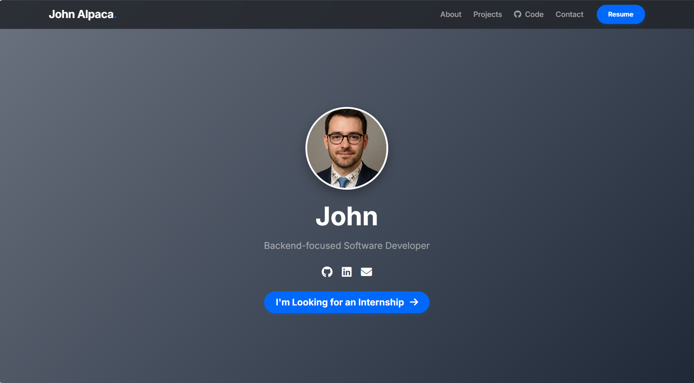

# Jordan Ascanoa – Developer Portfolio

> A modern, responsive developer portfolio built with Django, showcasing my projects, skills, and background.

## 🌟 Overview

This repository contains the source code for my developer portfolio website.  
It is built with Django and uses models to dynamically render content such as my bio, skills, projects, and resume.  
The site is designed to be clean, responsive, and easy to maintain, serving as a central hub for my technical work.  
By open-sourcing the project, I aim to demonstrate my code quality, architectural decisions, and approach to building maintainable backend-driven web applications.

## ✨ Features

- **Dynamic profile, skills, and projects**  
  All content is stored in Django models (`Bio`, `Skill`, `Project`, `Technology`, `Resume`) and rendered dynamically across the site.

- **Project showcase with tech stack**  
  Projects include descriptions, images, demo links, GitHub URLs, and a Many-to-Many technology stack displayed as badges.

- **Resume management system**  
  The `Resume` model enforces a single active resume using database constraints and custom logic, displayed via a dedicated download section.

- **Backend-driven layout and content injection**  
  A shared `base.html` template provides global layout, while views supply data (bio, skills, projects, resume) to the homepage.

- **Responsive UI with modern tooling**  
  Built with Bootstrap 5, Google Fonts (Inter), Font Awesome, and custom CSS for a clean, responsive, and polished user experience.


## 🧰 Tech Stack

**Backend:** Django 5.2, Python 3.13  
**Database:** SQLite (development)  
**Templating:** Django Templates, Bootstrap 5  
**Content Management:** Django Admin  
**Frontend:** HTML, CSS, Bootstrap, Google Fonts (Inter), Font Awesome  
**Deployment:** Render (Gunicorn, PostgreSQL)  
**Version Control:** Git & GitHub

## 🛠️ Installation & Local Setup

Follow these steps to run the project locally.

### 1️⃣ Clone the repository

```bash
git clone https://github.com/Jead100/portfolio_site.git
cd portfolio_site
```

### 2️⃣ Create and activate a virtual environment

```bash
python -m venv venv
source venv/bin/activate     # macOS/Linux
venv\Scripts\activate        # Windows
```

### 3️⃣ Install dependencies

```bash
pip install -r requirements.txt
```

### 4️⃣ Set up environment variables

This project loads Django settings (secret key, debug mode, etc.) from an `.env` file.

Copy the example environment file into a new `.env` file:

```bash
cp .env.example .env      # macOS/Linux
copy .env.example .env    # Windows
```

When `DEBUG=True`, the project automatically uses:

* SQLite as the database
* Local `media/` directory for uploaded files

No further configuration is needed for local development.

### 5️⃣ Apply migrations

```bash
python manage.py migrate
```

### 6️⃣ Load demo data (optional)

A sample dataset is included to populate the site with example bio, skills, projects, and resume info:

```bash
python manage.py loaddata demo_data.json
```

### 7️⃣ Run the development server

```bash
python manage.py runserver
```

Your local site will now be available at:

```
http://127.0.0.1:8000/
```

## 📸 Screenshots

Below are example previews of the site populated with demo data:



---


## 📬 Contact

If you'd like to get in touch, feel free to reach me at **ascanoa.jordan@gmail.com** or connect with me on [LinkedIn](https://www.linkedin.com/in/jordanead/).

## 🤝 Contributing

This project is open source, but primarily serves as my personal portfolio. If you have suggestions or spot an issue, feel free to open an issue or submit a pull request.

## 📄 License

This project is licensed under the MIT License. See the [LICENSE](./LICENSE) file for details.
